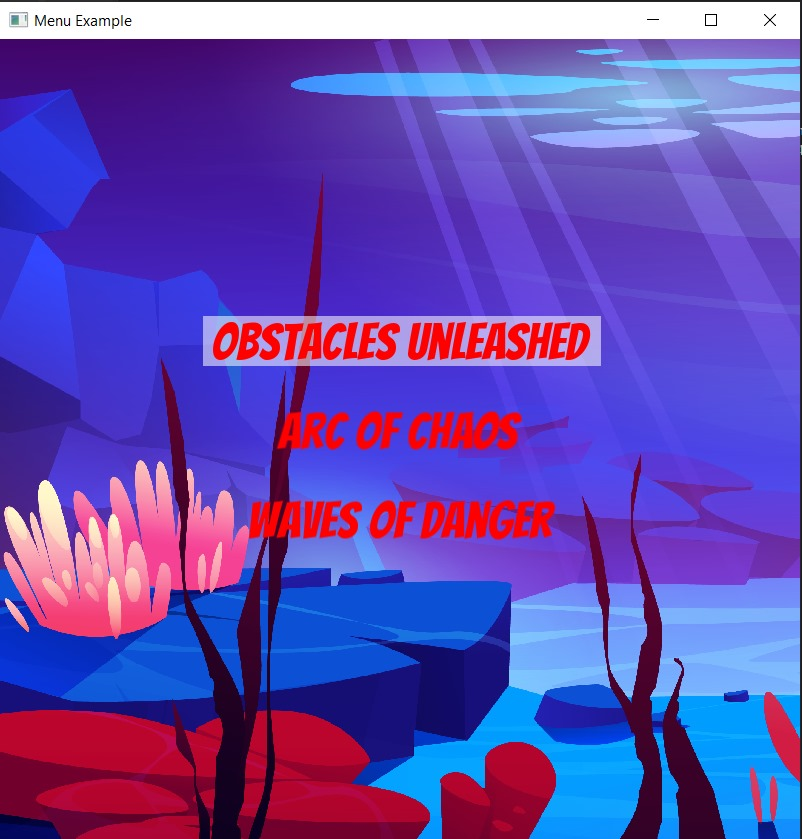

# 🌊 Hydronaut: Underwater Math Adventure

Hydronaut is a 2D underwater game developed in C++ using SFML. In this game, you control a submarine navigating through dynamic, math-based obstacles. From sine waves to parabolic spikes, the challenge evolves as you dive deeper into the ocean.

## 📸 Screenshots

### 🟢 Game Start Screen


## 🎥 [Click here to watch the gameplay video](screenshots/video.mp4)

## 🎮 Gameplay

- Move your submarine in all four directions using arrow keys.
- Avoid colliding with mathematical obstacles like:
  - 🌊 **Sine wave traps**
  - 🔁 **Exponential sine curves**
  - 🧱 **Parabolic walls**
- The longer you survive, the harder the patterns become.

## ✨ Features

- Dynamic movement using SFML's real-time rendering.
- Enemy/obstacle generation using:
  - `y = sin(x)`
  - `y = e^sin(x)`
- Clean and modular C++ codebase.
- Smooth submarine controls.
- Intuitive collision detection (based on shape boundaries).
- Easy to build and extend.

## 🔧 Technologies Used

- **Language**: C++
- **Graphics/Windowing**: [SFML](https://www.sfml-dev.org/) (Simple and Fast Multimedia Library)
- **IDE**: VS Code
- **Math**: Standard C++ math functions

## 🚀 How to Run

### Prerequisites

- C++17 or higher
- SFML 


```bash
# Clone the repository
https://github.com/muneebahmed-nust/hydronaut.git


